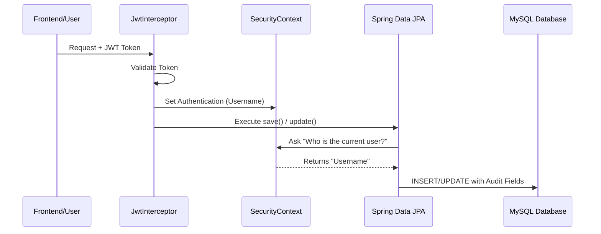

# 🕵️ DMS Auditing Workflow: Technical Deep-Dive

This document explains how our system automatically tracks **who** created/modified a record and **when** it happened.

---

## 🏗️ 1. The High-Level Architecture
The workflow follows a 5-step process for every API request:



---

## 💻 2. Component-by-Component Breakdown

### Layer 1: Authentication (`JwtInterceptor.java`)
This is the "Entry Gate". It extracts the user from the JWT and registers them in the system's memory.
```java
// Synchronize with Spring Security context
UsernamePasswordAuthenticationToken auth = new UsernamePasswordAuthenticationToken(
        username, null, roles);
SecurityContextHolder.getContext().setAuthentication(auth);
```

### Layer 2: The Provider (`AuditorAwareImpl.java`)
This class is the "Bridge". It tells JPA exactly where to find the username.
```java
public Optional<String> getCurrentAuditor() {
    Authentication auth = SecurityContextHolder.getContext().getAuthentication();
    if (auth == null || !auth.isAuthenticated()) return Optional.of("SYSTEM");
    return Optional.ofNullable(auth.getName());
}
```

### Layer 3: The Base Entity (`BaseEntity.java`)
This is the "Template". It uses JPA annotations to mark which fields should be handled automatically.
```java
@MappedSuperclass
@EntityListeners(AuditingEntityListener.class)
public abstract class BaseEntity {
    @CreatedBy
    private String createdBy; // Filled automatically on INSERT
    
    @LastModifiedBy
    private String lastModifiedBy; // Updated automatically on UPDATE
    
    @CreatedDate
    private LocalDateTime createdAt;
}
```

### Layer 4: Configuration (`JpaConfig.java`)
This "Turns on the Engine". Without this, the annotations like `@CreatedBy` are ignored.
```java
@Configuration
@EnableJpaAuditing(auditorAwareRef = "auditorProvider")
public class JpaConfig { ... }
```

---

## 🛠️ 3. Database Schema
Our Flyway migrations ensure the tables have the required columns:
- `created_at`: TIMESTAMP
- `updated_at`: TIMESTAMP
- `created_by`: VARCHAR(255)
- `last_modified_by`: VARCHAR(255)

---

## 🚀 4. Summary of Benefits
1.  **Zero Manual Work**: Services don't need to call `setCreatedBy()`. It happens automatically.
2.  **Accountability**: Every single record change is permanently linked to the user who did it.
3.  **Consistency**: Every table in our DB follows the exact same auditing naming convention.
