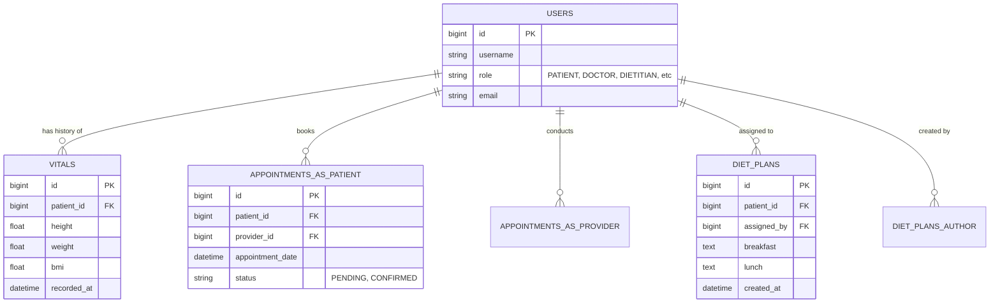
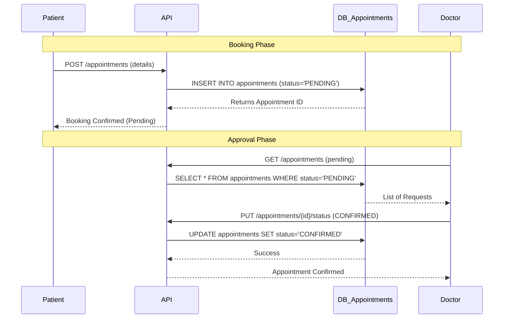
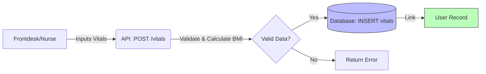

# Database Flow & Diagrams

This document visualizes the database structure and data flow for the DMS using Mermaid diagrams.

## 1. Entity-Relationship Diagram (ERD)
This diagram shows how the tables are related to each other.

## 2. Key Data Flows

### A. Appointment Booking Flow
How data moves when an appointment is booked and managed.

### B. Patient Vitals Recording Flow
How health data is tracked over time.

