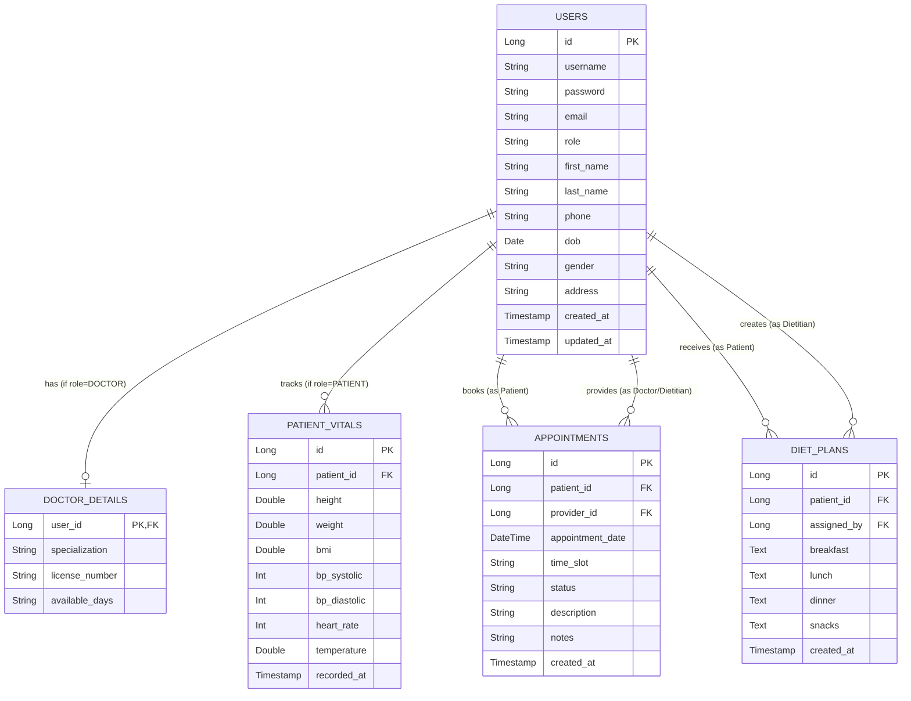

# Database Entity Relationship Diagram (ERD) Analysis

## Overview
This document provides a visual and analytical representation of the database schema required for the Doctor/Dietitian Management System (DMS). Use this as a reference for implementing the JPA Entities and Database Tables.

## ER Diagram
The following diagram illustrates the relationships between the core entities: `Users`, `DoctorDetails`, `Appointments`, `Vitals`, and `DietPlans`.

## Relationship Analysis

### 1. User Management (Central Entity)
The `USERS` table serves as the central identity store. Rather than having separate tables for Doctors, Patients, and Admins, a single table with a `role` discriminator is used (Single Table Inheritance strategy logic).
- **Benefits**: Simplifies authentication (one login table), allows for easier role management (e.g., an Admin who is also a Patient).
- **Constraints**: 
  - `email` and `username` must be unique.
  - `role` defines permissions.

### 2. Doctor Details (`1:0..1`)
Relationship: **One-to-One** (Optional)
- A generic `User` may not have these details.
- Only users with `role = DOCTOR` should have an associated record in `DOCTOR_DETAILS`.
- The `user_id` serves as both Primary Key and Foreign Key to ensuring strict 1:1 mapping.

### 3. Appointments (`N:M` resolved via Entity)
Relationship: **Many-to-One** (to Patient) and **Many-to-One** (to Provider)
- An Appointment connects TWO users: a Patient and a Provider.
- `patient_id`: The User measuring role=PATIENT.
- `provider_id`: The User measuring role=DOCTOR or DIETITIAN.
- **Status Workflow**: Appointments cycle through states (PENDING -> CONFIRMED -> COMPLETED/REJECTED).

### 4. Vitals (`1:N`)
Relationship: **One-to-Many**
- A single Patient (`USERS`) can have multiple `PATIENT_VITALS` records over time.
- This allows tracking health trends (e.g., weight loss progress, blood pressure history).

### 5. Diet Plans (`1:N`)
Relationship: **One-to-Many**
- A Patient can receive multiple Diet Plans over time.
- Like appointments, this links a Patient (`patient_id`) and a creator (`assigned_by`, usually a Dietitian).

## Key Design Considerations
1. **Audit Logs**: Timestamps (`created_at`, `updated_at`) are crucial for medical records.
2. **Soft Deletes**: Consider adding an `is_active` or `deleted_at` column to `USERS` and `APPOINTMENTS` to prevent accidental loss of historical medical data.
3. **Security**: Ensure `password` is never returned in API responses.
