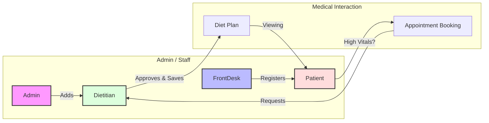
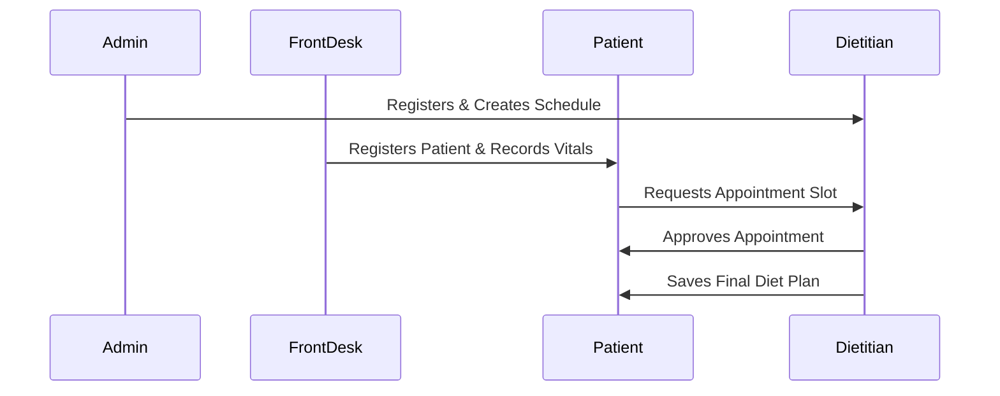

# 🏥 DMS: Role-Based Project Workflow

This document outlines the core workflows of the Diet Management System (DMS) through the lens of its **4 primary user roles**.

---

## 🔄 User Interaction Ecosystem

The workflow is a collaborative cycle where each role depends on the previous one's output.

---

## � 1. System Admin
**Goal**: Manage the provider network and system health.
- **Key Actions**:
    - **Add Dietitians**: Creates the user and triggers automatic **Default Schedule** generation.
    - **Monitor Logs**: Uses global logging to track system-wide events.
- **File Reference**: [add-dietitian.component.ts](file:///home/artem/Desktop/DMS-Main/DMS/src/app/features/dietitian-management/add-dietitian/add-dietitian.component.ts)

## 👤 2. FrontDesk (Staff)
**Goal**: Handle onboarding and initial patient data.
- **Key Actions**:
    - **Register Patients**: The first entry point for any patient in the system.
    - **Record Vitals**: Mandatory first step. Without vitals, a patient cannot proceed to booking.
- **File Reference**: [registration.component.ts](file:///home/artem/Desktop/DMS-Main/DMS/src/app/features/registration/registration.component.ts) | [VitalsController.java](file:///home/artem/Desktop/DMS-Main/DMS-Backend/src/main/java/com/example/DMS_Backend/controllers/VitalsController.java)

## 👤 3. Patient
**Goal**: Receive professional dietary guidance.
- **Key Actions**:
    - **Search & Book**: Browses available dietitians and selects a slot.
    - **View Plans**: Accesses the latest diet plans generated after appointments.
- **File Reference**: [doctor-selection.component.ts](file:///home/artem/Desktop/DMS-Main/DMS/src/app/features/doctor-selection/doctor-selection.component.ts) | [diet-plan-view.component.ts](file:///home/artem/Desktop/DMS-Main/DMS/src/app/features/diet-plan-view/diet-plan-view.component.ts)

## � 4. Dietitian
**Goal**: Manage the clinic queue and provide diet plans.
- **Key Actions**:
    - **Manage Appointments**: Approves or cancels incoming patient requests.
    - **Generate Diet Plan**: Finalizes the appointment by saving a detailed plan for the patient.
- **File Reference**: [appointment.component.ts](file:///home/artem/Desktop/DMS-Main/DMS/src/app/features/appointments/appointment.component.ts) | [DietPlanService.java](file:///home/artem/Desktop/DMS-Backend/src/main/java/com/example/DMS_Backend/service/DietPlanService.java)

---

## 📊 Complete Flow Sequence

