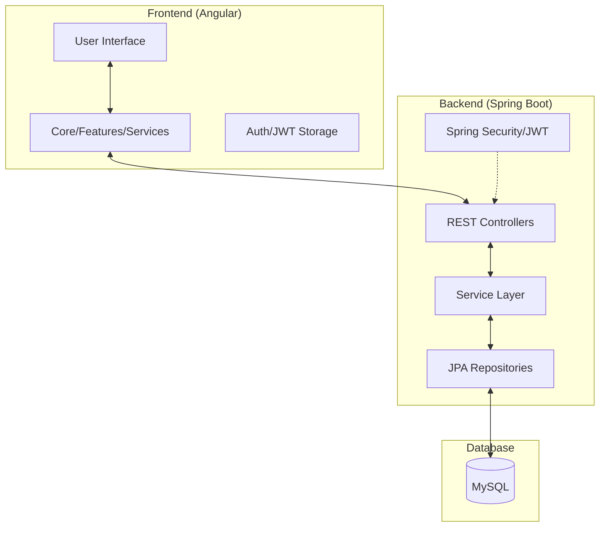
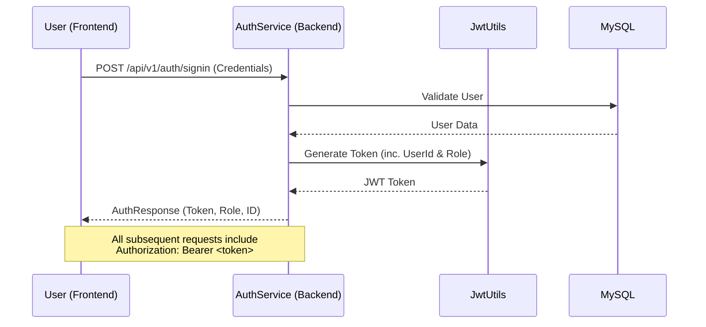
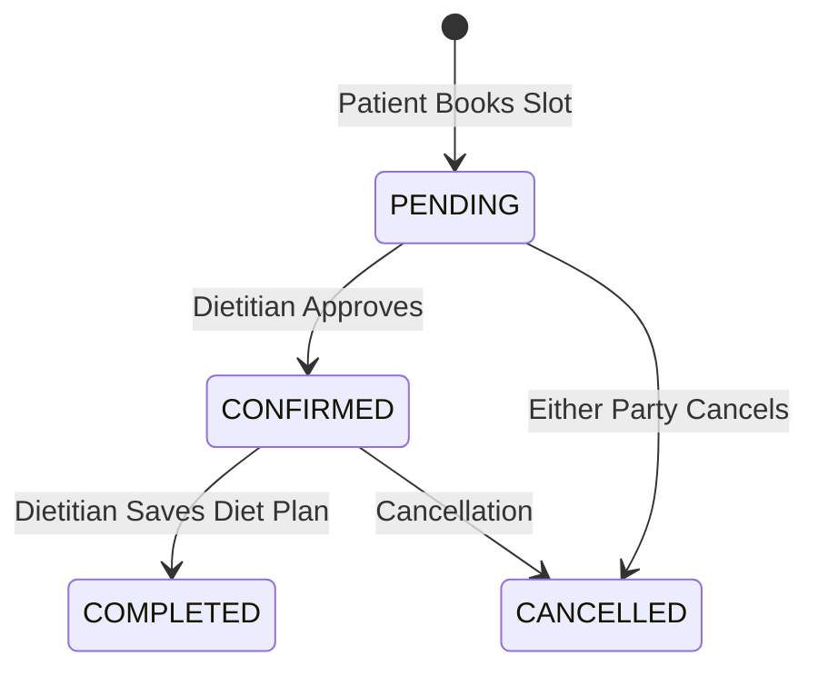

# 🏥 Diet Management System (DMS) - Comprehensive Project Flow

This guide provides a structural and functional overview of the DMS project, explaining how the Angular frontend and Spring Boot backend collaborate to provide a seamless healthcare experience.

---

## 🏗️ System Architecture

The project follows a modern **Monorepo-style** structure with a decoupled Frontend and Backend.

---

## 🔐 Authentication & Authorization Flow

The system uses **JWT (JSON Web Tokens)** for secure communication.

---

## 🚀 The Core Patient Journey

This is the primary workflow of the system, from registration to receiving a diet plan.

### 1. Registration & Onboarding
Patients are registered by staff (FrontDesk) or can self-register depending on the config.
- **Frontend**: [registration.component.ts](file:///home/artem/Desktop/DMS-Main/DMS/src/app/features/registration/registration.component.ts)
- **Backend**: `AuthService.registerPatient()` in [AuthService.java](file:///home/artem/Desktop/DMS-Main/DMS-Backend/src/main/java/com/example/DMS_Backend/service/AuthService.java)

### 2. Vitals Recording (The Gatekeeper)
A patient **cannot** book an appointment until their vitals (Weight, Height, Blood Pressure, etc.) are recorded.
- **Service**: [VitalsService.java](file:///home/artem/Desktop/DMS-Main/DMS-Backend/src/main/java/com/example/DMS_Backend/service/VitalsService.java)
- **Logic**: `AppointmentService` checks `vitalsRepository.existsByPatient(patient)` before allowing a booking.

### 3. Appointment Lifecycle
The heart of the interaction between Patient and Dietitian.

- **Conflict Detection**: The system prevents double bookings in [AppointmentService.java](file:///home/artem/Desktop/DMS-Main/DMS-Backend/src/main/java/com/example/DMS_Backend/service/AppointmentService.java).
- **Default Schedules**: When a dietitian is added, a default schedule is automatically generated via `DietitianScheduleService`.

### 4. Diet Plan Generation
Once the consultation is over, the dietitian submits the plan.
- **Service**: [DietPlanService.java](file:///home/artem/Desktop/DMS-Main/DMS-Backend/src/main/java/com/example/DMS_Backend/service/DietPlanService.java)
- **Storage**: Maps the plan to the patient and marks the appointment as `COMPLETED`.
- **View**: Patients view their latest plan in the [DietPlanViewComponent](file:///home/artem/Desktop/DMS-Main/DMS/src/app/features/diet-plan-view/diet-plan-view.component.ts).

---

## 🛠️ Key Technical Implementations

- **Global Exception Handling**: Centrally managed in [GlobalExceptionHandler.java](file:///home/artem/Desktop/DMS-Main/DMS-Backend/src/main/java/com/example/DMS_Backend/exception/GlobalExceptionHandler.java) to ensure consistent API error responses.
- **Mapper Pattern**: [MapStruct](file:///home/artem/Desktop/DMS-Main/DMS-Backend/src/main/java/com/example/DMS_Backend/mapper/) is used to convert between Entities and DTOs, keeping the codebase clean.
- **Builder Pattern**: Entities and DTOs use the Lombok `@Builder` for readable object construction.
- **Role-Based Routing**: The Angular frontend uses guards to restrict access based on the `ROLE_PATIENT`, `ROLE_DIETITIAN`, or `ROLE_ADMIN`.

---

> [!NOTE]
> This document is a live companion to the codebase. For specific logic details, refer to the linked source files.
