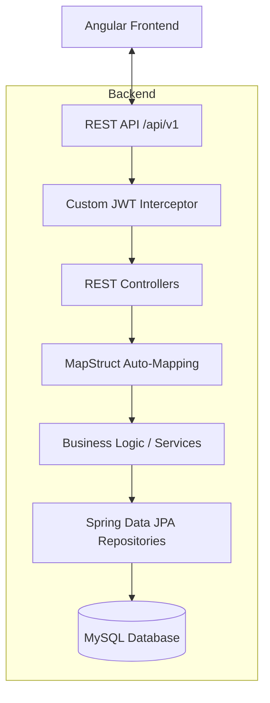

# DMS Project: Comprehensive Technical Architecture & Optimization Report

## Executive Summary
The Diet Management System (DMS) is built on a modern, decoupled architecture using **Spring Boot 4.0** for the backend and **Angular** for the frontend. The project emphasizes **maintainability, performance, and developer efficiency** through the strategic use of automated mapping, radical boilerplate reduction, and a customized security model.

---

## 1. System Architecture Overview

The system follows a standard yet optimized request-response lifecycle.



### 1.1 Decision Rationale: Decoupled DTOs
We maintain a strict separation between **Entities** (database representation) and **DTOs** (API representation). 
- **Benefit:** Allows the database schema to evolve independently of the public API, preventing breaking changes for frontend consumers and enhancing security by exposing only necessary fields.

---

## 2. Backend Deep-Dive: Key Optimizations

### 2.1 Custom Lightweight Security Model
Unlike standard Spring Security which relies on complex filter chains, DMS uses a **Custom Interceptor Pattern**.

- **Implementation:** [JwtInterceptor.java](file:///home/artem/Desktop/DMS-Main/DMS-Backend/src/main/java/com/example/DMS_Backend/config/JwtInterceptor.java)
- **Feature:** An elegant `@RequireRole` annotation allows declarative access control at the method or class level.
- **CTO Value:** Dramatically reduces the security configuration surface area, making the auth flow easier to audit and customize without fighting framework defaults.

```java
@RequireRole("ADMIN")
public List<UserResponse> getAllUsers() { ... }
```

### 2.2 Performance-Driven Object Mapping (MapStruct)
Manual object mapping is error-prone and slow to develop. We use **MapStruct** to generate high-performance mapping code at compile-time.
- **Reference:** [PatientMapper.java](file:///home/artem/Desktop/DMS-Main/DMS-Backend/src/main/java/com/example/DMS_Backend/mapper/PatientMapper.java)
- **Benefit:** Eliminates "Reflection" overhead found in other mappers (like ModelMapper), resulting in native Java performance for object conversion.

### 2.3 Boilerplate Liquidation (Lombok)
The codebase uses **Lombok** to eliminate hundreds of lines of getters, setters, and constructors.
- **Constructor Injection:** We use `@RequiredArgsConstructor` to ensure services are immutable and dependencies are explicitly injected via constructors, which is a modern Spring best practice over `@Autowired` on fields.

### 2.4 Centralized Error Orchestration
A [GlobalExceptionHandler](file:///home/artem/Desktop/DMS-Main/DMS-Backend/src/main/java/com/example/DMS_Backend/exception/GlobalExceptionHandler.java) intercepts all exceptions system-wide.
- **Benefit:** Consolidates error logic in one place. Every error response across the entire system follows the same JSON structure, simplifying frontend error handling and preventing sensitive internal data leaks.

---

## 3. Frontend Architecture: Angular Best Practices

The frontend is designed for scale using a **Modular Pattern**.

### 3.1 Directory Structure
- **Core/:** Single-instance services, interceptors, and universal configurations.
- **Shared/:** Reusable UI components (buttons, cards, modals), pipes, and directives used across all features.
- **Features/:** Domain-specific modules (Dashboard, Registration, Appointments) that encapsulate their own logic and routing.

### 3.2 Dynamic Role-Based Dashboards
Instead of a monolithic dashboard, DMS splits logic into role-specific components (`PatientDashboard`, `FrontDeskDashboard`).
- **Optimization:** Reduces component complexity and code size, ensuring users only load the logic relevant to their role.

---

## 4. Database Integrity & Design

### 4.1 Relationship Management
The database schema utilizes **Hibernate-level Cascading** and **Relational Constraints**.
- **Example:** [Appointment](file:///home/artem/Desktop/DMS-Main/DMS-Backend/src/main/java/com/example/DMS_Backend/models/Appointment.java#11-62) entities are mapped with `OnDelete(action = OnDeleteAction.CASCADE)` to ensure data consistency when users are removed.
- **Optimization:** Strategic use of `JOIN FETCH` queries in repositories to prevent the "N+1 Problem," ensuring complex data fetches (like appointments with patient/dietitian details) happen in a single efficient SQL query.

---

## 5. Summary Table for CTO Review

| Pillar | Implementation | Competitive Advantage |
| :--- | :--- | :--- |
| **Maintainability** | Lombok + MapStruct | Cleanest possible code; mapping logic is decoupled and automated. |
| **Security** | JWT Interceptor + Custom Annotations | Transparent, easy-to-read auth logic; less complex than standard Spring Security. |
| **Reliability** | Global Exception Handling + Validation | Predictable system behavior; robust API contracts. |
| **Performance** | Compile-time Mapping + JPA Fetch Optimization | High throughput; minimal memory overhead for object conversion. |
| **Scalability** | Feature-based Angular Modularity | Team can work on separate modules without merge conflicts. |

---

## Future Roadmap Potential
- **Microservices Ready:** The decoupled nature of the services and DTOs makes this project a prime candidate for microservice extraction if load scales.
- **Observability:** Centralized Slf4j logging is primed for integration with ELK stack or Prometheus/Grafana for real-time monitoring.
