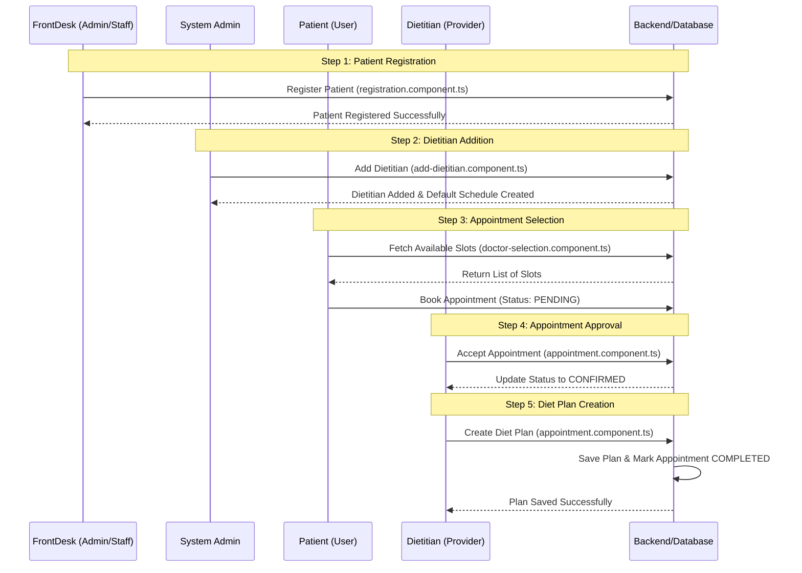

# Comprehensive Workflow Explanation: Patient-Dietitian Interaction

This document provides a detailed, line-by-line explanation of the project workflow from patient registration to diet plan creation.

## Workflow Overview



---

## Step 1: Patient Registration by Frontdesk

The registration process is handled by a staff member or staff component.

### Frontend Explanation
**File:** [registration.component.ts](file:///home/artem/Desktop/DMS-Main/DMS/src/app/features/registration/registration.component.ts)

*   **Line 46-47:** `onSubmit()` triggers when the form is submitted and valid.
*   **Line 50-62:** A `newUser` object is constructed from form values.
*   **Line 64:** `authService.registerPatient(newUser, formVal.password)` is called.
*   **Line 67:** On success, a PrimeNG Toast message is shown: "Patient Registered Successfully".

### Backend Explanation
**File:** [AuthService.java](file:///home/artem/Desktop/DMS-Main/DMS-Backend/src/main/java/com/example/DMS_Backend/service/AuthService.java)

*   **Line 59-64:** Checks if the username or email already exists in the `UserRepository`.
*   **Line 74-85:** Uses the **Builder Pattern** to create a new `User` entity.
*   **Line 78:** `.role(Role.valueOf(signUpRequest.getRole()))` sets the user role (e.g., `ROLE_PATIENT`).
*   **Line 87:** `userRepository.save(user)` persists the patient to the MySQL database.

---

## Step 2: Dietitian Addition by Admin

Admins can add new dietitians to the system.

### Frontend Explanation
**File:** [add-dietitian.component.ts](file:///home/artem/Desktop/DMS-Main/DMS/src/app/features/dietitian-management/add-dietitian/add-dietitian.component.ts)

*   **Line 105:** `appointmentService.addDietitian(...)` is called with dietitian details.
*   **Line 115:** Shows "Dietitian added successfully" upon success.

### Backend Explanation
**File:** [AuthService.java](file:///home/artem/Desktop/DMS-Main/DMS-Backend/src/main/java/com/example/DMS_Backend/service/AuthService.java)

*   **Line 89-91:** This logic is critical:
    ```java
    if (user.getRole() == Role.ROLE_DIETITIAN) {
        dietitianScheduleService.createDefaultSchedule(user);
    }
    ```
    When a dietitian is saved, the system automatically creates a default working schedule for them, allowing patients to see available slots immediately.

---

## Step 3: Patient Selects Dietitian and Books Appointment

Patients can view list of dietitians and choose a time slot.

### Frontend Explanation
**File:** [doctor-selection.component.ts](file:///home/artem/Desktop/DMS-Main/DMS/src/app/features/doctor-selection/doctor-selection.component.ts)

*   **Line 98:** `getAvailableSlots(doctorId, date)` fetches slots that are not already booked.
*   **Line 131:** `confirmBooking()` calls the booking API.
*   **Line 140:** Notifies patient: "Appointment Request Sent!".

### Backend Explanation
**File:** [AppointmentService.java](file:///home/artem/Desktop/DMS-Main/DMS-Backend/src/main/java/com/example/DMS_Backend/service/AppointmentService.java)

*   **Line 40:** `!vitalsRepository.existsByPatient(patient)` check ensures patients have vitals recorded before booking.
*   **Line 50:** Checks if the patient already has an active `PENDING` or `CONFIRMED` appointment.
*   **Line 63-71:** Checks for **Time Slot Conflicts** for that specific dietitian.
*   **Line 87:** Sets initial status to `AppointmentStatus.PENDING`.

---

## Step 4: Dietitian Approves Appointment

Dietitians view their dashboard to manage requests.

### Frontend Explanation
**File:** [appointment.component.ts](file:///home/artem/Desktop/DMS-Main/DMS/src/app/features/appointments/appointment.component.ts)

*   **Line 65:** The "Accept" button calls `updateStatus(appt, 'CONFIRMED')`.
*   **Line 238:** Calls the backend `updateStatus` API.

### Backend Explanation
**File:** [AppointmentService.java](file:///home/artem/Desktop/DMS-Main/DMS-Backend/src/main/java/com/example/DMS_Backend/service/AppointmentService.java)

*   **Line 124:** `appointment.setStatus(status)` updates the entity state.
*   **Line 129:** `appointmentRepository.save(appointment)` persists the update.

---

## Step 5: Dietitian Adds Diet Plan

Once an appointment is confirmed, the dietitian can create a specific plan.

### Frontend Explanation
**File:** [appointment.component.ts](file:///home/artem/Desktop/DMS-Main/DMS/src/app/features/appointments/appointment.component.ts)

*   **Line 112:** "Save & Complete" button triggers `saveDietPlan()`.
*   **Line 198:** `patientService.saveDietPlan(patientId, newPlan)` sends the data to the backend.
*   **Line 200:** `updateStatus(appt, 'COMPLETED')` automatically marks the appointment as finished.

### Backend Explanation
**File:** [DietPlanService.java](file:///home/artem/Desktop/DMS-Backend/src/main/java/com/example/DMS_Backend/service/DietPlanService.java)

*   **Line 32-41:** A new `DietPlan` entity is built with Breakfast, Lunch, Dinner, and Snacks.
*   **Line 41:** `dietPlanRepository.save(dietPlan)` stores the plan.
*   **Line 49:** `findFirstByPatientOrderByCreatedAtDesc` ensures the patient always sees their **latest** plan in the "My Diet Plan" view.

---

> [!TIP]
> This end-to-end integration ensures that data flows synchronously from Admin (setup) to Patient (engagement) and finally to Dietitian (execution).
